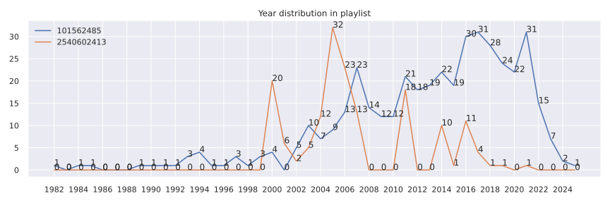

# NeteaseCloudMusicDownloader
***

# 目录
  <!-- TOC depthFrom:1 depthTo:6 withLinks:1 updateOnSave:1 orderedList:0 -->

  - [NeteaseCloudMusicDownloader](#neteasecloudmusicdownloader)
  - [目录](#目录)
  - [依赖](#依赖)
  - [参考项目](#参考项目)
  - [netease rename 网易云音乐缓存重命名](#netease-rename-网易云音乐缓存重命名)
  	- [功能](#功能)
  	- [使用说明示例](#使用说明示例)
  	- [参数](#参数)
  - [netease download playlist 网易云音乐下载播放列表](#netease-download-playlist-网易云音乐下载播放列表)
  	- [功能](#功能)
  	- [使用说明示例](#使用说明示例)
  	- [参数](#参数)
  - [netease refresh by playlist 根据播放列表更新本地文件](#netease-refresh-by-playlist-根据播放列表更新本地文件)
  	- [功能](#功能)
  	- [使用说明示例](#使用说明示例)
  	- [参数](#参数)
  - [Test 功能测试](#Test-功能测试)

  <!-- /TOC -->
# 依赖
  - Python 版本
    ```sh
    $ python --version
    # Python 3.7.3
    ```
  - **pip 安装包**
    ```shell
    $ pip install eyed3 requests shutil pycryptodomex
    ```
    - **eyed3** mp3 文件属性赋值，如 title / artist / album / album_artist
    - **requests** 网页请求
    - **shutil** 文件复制
    - **Crypto** 加密

# 参考项目
  - [Binaryify/NeteaseCloudMusicApi](https://github.com/Binaryify/NeteaseCloudMusicApi.git)
  - [codezjx/netease-cloud-music-dl](https://github.com/codezjx/netease-cloud-music-dl)
  - [YongHaoWu/NeteaseCloudMusicFlac](https://github.com/YongHaoWu/NeteaseCloudMusicFlac)
  - [0xHJK/music-dl](https://github.com/0xHJK/music-dl)
  - [lchloride/NeteaseMusicCacheDecode](https://github.com/lchloride/NeteaseMusicCacheDecode)
***

# netease rename 网易云音乐缓存重命名
## 功能
  - 重命名 mp3 文件，查找 song id 对应的 `歌手名` 与 `歌曲名`，并将文件重命名为 `歌手名 - 歌曲名.mp3`，同时更新 ID3 信息与专辑封面
    ```md
    From: source path/<song id>-<bite rate>-<random number>.mp3
    To: dist path/<artist name> - <song title>.mp3
    ```
## 使用说明示例
  - 在 Ubuntu 上使用网易云音乐的客户端，其缓存直接是 mp3 文件，缓存在 `~/.cache/netease-cloud-music/CachedSongs/`
    ```shell
    $ ls ~/.cache/netease-cloud-music/CachedSongs/ -1
    1609689-320-b70d1d38edd3f443bc503f592fc440ed.mp3
    25638306-320-3d42ddad5384518bbbf8bc68fff4cdfa.mp3
    4254253-128-1fb4ae7055ea4ceb36862f6228e61aa4.mp3
    441116287-128-0d15579de47acbe4c8177e54ba43bf4b.mp3
    ```
  - 因此主要需要的是重命名，使用如下
    ```shell
    $ python netease_rename.py
    source = ~/.cache/netease-cloud-music/CachedSongs, dist = ./output_music
    song_id = 25638306, tt.tag title = ありがとう…, artist = KOKIA, album = ありがとう…, album_artist = KOKIA
    song_id = 441116287, tt.tag title = 茜さす, artist = Aimer, album = 茜さす/everlasting snow, album_artist = Aimer
    song_id = 4254253, tt.tag title = Mustang cabriolet, artist = Paris Brune, album = L’œil du cyclone, album_artist = Paris Brune
    song_id = 1609689, tt.tag title = Vale Of Tears, artist = Jay Clifford, album = Silver Tomb For The Kingfisher, album_artist = Jay Clifford
    ```
  - 输出
    ```shell
    $ ls ./output_music/ -1
    'Aimer - 茜さす.mp3'
    'Jay Clifford - Vale Of Tears.mp3'
    'KOKIA - ありがとう….mp3'
    'Paris Brune - Mustang cabriolet.mp3'
    ```
## 参数
  - `-h, --help` 帮助信息
  - `-d DIST_PATH, --dist_path DIST_PATH` 输出路径，默认 `./output_music`
  - `-s SOURCE_PATH, --source_path SOURCE_PATH` 输入文件夹路径，缓存文件地址，默认 `$HOME/.cache/netease-cloud-music/CachedSongs`
  - `-r, --remove_source` 指定删除源文件，默认保留源文件
  - `--song_id_list` 指定 song id list，只输出对应的歌曲名称，格式可以是 `1 2 3` 或 `1, 2, 3`
  - 示例
    ```shell
    # 帮助信息
    ./netease_rename.py -h
    # 指定其他输出路径
    ./netease_rename.py -d ~/output_music
    # 指定其他输入路径，并指定删除源文件
    ./netease_rename.py -s ./CachedSongs --remove_source
    # 指定 song id list，输出对应的歌曲名称
    ./netease_rename.py --song_id_list 25638306 441116287, 4254253
    ```
***

# netease download playlist 网易云音乐下载播放列表
## 功能
  - 根据 playlist /album 下载音乐文件到本地，如果本地指定的文件夹中存在同名文件则跳过
  - 支持多种不同的下载方式 netease / baidu / qq / migu / kugou
    - Netease outer
    - Netease bitrate
    - QQ Music
    - Migu Music
    - Kugou Music
    - Baidu mp3
    - Baidu flac
  - 可以同时指定多个下载源，并按照顺序使用下载源下载
  - 支持指定 `<song id list>` 下载，如果指定了，则优先级高于 playlist /album
  - 通过 `num_workers` 参数指定同时下载的线程数量，默认 `10`，在调试时应指定为 `1`，否则 log 输出顺序被打乱
## 使用说明示例
  - **开始下载**
    ```shell
    $ ./netease_download_playlist.py -p 101562485 -d ~/Downloads/netease

    ...
    song id = 22701801, bytes write = 9.59M
    song_id = 22701801, tt.tag {title = ありがとう..., artist = KOKIA, album = Complete collection 1998-1999, album_artist = KOKIA}
    dist_name = /home/leondgarse/Downloads/netease/KOKIA - ありがとう....mp3
    ...
    song id = 441116287, bytes write = 5.04M
    song_id = 441116287, tt.tag {title = 茜さす, artist = Aimer, album = 茜さす/everlasting snow, album_artist = Aimer}
    dist_name = /home/leondgarse/Downloads/netease/Aimer - 茜さす.mp3
    ...
    ```
  - **下载失败的文件**
    ```shell
    >>>> download_url is None, maybe it is limited by copyright. song_id = 497762
    >>>> File NOT downloaded, song_id = 497762
    ```
  - **本地已有的文件**
    ```shell
    File /home/leondgarse/Downloads/netease/Wiz Khalifa - See You Again.mp3 exists, skip downloading
    dist_name = /home/leondgarse/Downloads/netease/Wiz Khalifa - See You Again.mp3

    File /home/leondgarse/Downloads/netease/Charlie Puth - Need You Now.mp3 exists, skip downloading
    dist_name = /home/leondgarse/Downloads/netease/Charlie Puth - Need You Now.mp3
    ```
  - **下载完成**
    ```shell
    Song not downloaded:
        497762: スガシカオ - 19才
        27533158: Kari Kimmel - Fingerprints

    Song downloaded id: [287025, 29481242, ...]

    Song not downloaded id: [497762, 27533158, ...]

    Downloaded = 190, NOT downloaded = 14
    ```
## 参数
  - `-h, --help` 帮助信息
  - `-d DIST_PATH, --dist_path DIST_PATH` 下载的输出路径，默认 `./netease_download_music`
  - `-p PLAYLIST, --playlist PLAYLIST` 下载的播放列表，默认 `101562485`
  - `-a ALBUM, --album ALBUM` 下载的专辑，默认 `None`
  - `-Q, --queue` 根据缓存的播放列表 `~/.cache/netease-cloud-music/StorageCache/webdata/file/queue` 下载，默认 `False`
  - `--song_id_list [SONG_ID_LIST [SONG_ID_LIST ...]]` 指定一个 song id list 下载，而不使用 playlist，格式可以是 `1 2 3` 或 `1, 2, 3`
  - `-n NUM_WORKERS, --num_workers NUM_WORKERS` 指定同时下载的线程数量，默认 `10`
  - `--outer` 指定使用 outer url 方式下载，默认方式
  - `--bitrate` 指定使用 bitrate url 方式下载，可以指定 bitrate=320k，容易检测为 cheating
  - `--baidu_flac` 指定使用 Baidu flac 方式下载，可以下载 flac 格式的无损音乐，出错率高
  - `--baidu_mp3` 指定使用 Baidu MP3 方式下载，出错率高
  - `--qq` 指定使用 QQ music 方式下载，根据名称搜索
  - `--migu` 指定使用 MIGU music 方式下载，根据名称搜索
  - `--kugou` 指定使用 KUGOU music 方式下载，根据名称搜索
  - `--all` 按照顺序使用所有下载源下载，适合下载 `bitrate` 方式下载失败的 song id list
  - 示例
    ```shell
    # 帮助信息
    ./netease_download_playlist.py -h
    # 指定要下载的 playlist
    ./netease_download_playlist.py -p 123123123
    # 指定其他输出路径
    ./netease_download_playlist.py -d ~/Music/netease_download_music
    # 指定其他下载方式
    ./netease_download_playlist.py --baidu_flac -p 123123123 -d ~/Music/netease_flac
    # 指定  <song id list>
    ./netease_download_playlist.py --song_id_list 123 456 798, 1234, 4567, 7980 --outer -d ~/Music/netease_outer
    # 指定多个下载源
    ./netease_download_playlist.py --qq --migu --song_id_list 123 456 798, 1234, 4567, 7980 --outer -d ~/Music/netease_outer
    ```
***

# netease refresh by playlist 根据播放列表更新本地文件
## 功能
  - 根据播放列表 `<playlist>` 更新本地文件 `<source_path>`，并将文件移动到 `<dist_path>`
    - 检查播放列表中的音乐文件
    - 如果 `<dist_path>` 中存在该文件，保留
    - 如果 `<source_path>` 中存在该文件，移动到 `<dist_path>`
    - 如果本地都不存在，从 Netease 下载并移动到 `<dist_path>`
  - 所有文件都会更新 ID3 信息，并重新下载专辑封面图片
  - 选项 `<--with_size_check>` 指定对比文件大小，会尝试下载音乐文件，如果下载的文件大小大于本地文件 **500K**，则保留下载的文件
  - 通过 `num_workers` 参数指定同时下载的线程数量，默认 `10`，在调试时应指定为 `1`，否则 log 输出顺序被打乱
## 使用说明示例
  - **开始更新**
    ```shell
    $ ./netease_refresh_by_playlist.py ~/Downloads/netease/ -p 101562485 -d ~/Downloads/netease_refreshed
    ...
    Source file exists: /home/leondgarse/Downloads/netease/KOKIA - ありがとう....mp3
    song_id = 22701801, tt.tag {title = ありがとう..., artist = KOKIA, album = Complete collection 1998-1999, album_artist = KOKIA}
    Move /home/leondgarse/Downloads/netease/KOKIA - ありがとう....mp3 to /home/leondgarse/Downloads/netease_refreshed/KOKIA - ありがとう....mp3
    ...
    Source file exists: /home/leondgarse/Downloads/netease/Aimer - 茜さす.mp3
    song_id = 441116287, tt.tag {title = 茜さす, artist = Aimer, album = 茜さす/everlasting snow, album_artist = Aimer}
    Move /home/leondgarse/Downloads/netease/Aimer - 茜さす.mp3 to /home/leondgarse/Downloads/netease_refreshed/Aimer - 茜さす.mp3
    ...
    ```
  - **重新下载的文件**
    ```shell
    Dowload from netease, song_id = 286970, title = 愚人的国度, artist = 孙燕姿
    song id = 286970, bytes write = 3.80M
    song_id = 286970, tt.tag {title = 愚人的国度, artist = 孙燕姿, album = 是时候, album_artist = 孙燕姿}
    Move /home/leondgarse/Downloads/netease_refreshed/286970-bite_rate-random_num.mp3 to /home/leondgarse/Downloads/netease_refreshed/孙燕姿 - 愚人的国度.mp3
    ```
  - **本地没有且下载失败的文件**
    ```shell
    Dowload from netease, song_id = 497762, title = 19才, artist = スガシカオ
    >>>> download_url is None, maybe it is limited by copyright. song_id = 497762
    Song not found, song_id = 497762, title = 19才, artist = スガシカオ
    ```
  - **更新完成**
    ```shell
    New downloaded size = 15
        286970: 孙燕姿 - 愚人的国度
        497762: スガシカオ - 19才
        27533158: Kari Kimmel - Fingerprints
        ...

    New downloaded id: [286970, 497762, 27533158, ...]
    ```
## 参数
  - `source_path` 包含音乐文件的源文件地址，必须参数
  - `-h, --help` 帮助信息
  - `-p PLAYLIST, --playlist PLAYLIST` 播放列表 ID，默认 `101562485`
  - `-a ALBUM, --album ALBUM` 专辑 ID，默认 `None`
  - `-Q, --queue` 根据缓存的播放列表 `~/.cache/netease-cloud-music/StorageCache/webdata/file/queue` 下载，默认 `False`
  - `--song_id_list [SONG_ID_LIST [SONG_ID_LIST ...]]` 指定一个 song id list 下载，而不使用 playlist，格式可以是 `1 2 3` 或 `1, 2, 3`
  - `-d DIST_PATH, --dist_path DIST_PATH` 输出路径，默认 `./Netease_refreshed`
  - `--with_size_check` 指定对比文件大小，如果下载的文件大小大于本地文件 500K，则保留下载的文件
  - `--outer` 指定使用 outer url 方式下载，默认方式
  - `--bitrate` 指定使用 bitrate url 方式下载，可以指定 bitrate=320k，容易检测为 cheating
  - `-n NUM_WORKERS, --num_workers NUM_WORKERS` 指定同时下载的线程数量，默认 `10`
  - 示例
    ```shell
    ~/Downloads/netease/ -p 101562485 -d ~/Downloads/netease_refreshed
    # 帮助信息
    ./netease_refresh_by_playlist.py -h
    # 指定要下载的 playlist
    ./netease_refresh_by_playlist.py ~/Downloads/netease/ -p 101562485
    # 指定其他输出路径
    ./netease_refresh_by_playlist.py ~/Downloads/netease/ -p 101562485 -d ~/Downloads/netease_refreshed
    # 指定对比文件大小
    ./netease_refresh_by_playlist.py ~/Downloads/netease/ -p 101562485 -d ~/Downloads/netease_refreshed --with_size_check
    ```
***

# Test 功能测试
## Python test
  ```py
  import pandas as pd
  import netease_rename
  import netease_download_playlist

  aa = netease_rename.netease_parse_playlist_2_list(playlist_id=101562485)
  dd = pd.DataFrame(netease_rename.detect_netease_music_name_list(aa)).drop(columns='cover_image')
  # bb = [ii for ii in netease_rename.detect_netease_music_name_list(aa) if ii['title'] == '简爱']
  bb = dd[dd.artist == '孙燕姿']
  print(bb.shape)
  # (15, 8)

  song_id = int(bb.song_id.iat[0])
  netease_download_playlist.netease_download_single_bit_rate(song_id=song_id, SIZE_ONLY=True)
  netease_download_playlist.netease_download_single_bit_rate(song_id=30431376, dist_path='./')
  print(dd.song_id.min(), dd.song_id.max())
  # 64634 1817458262

  print(dd.artist.value_counts().head(8))
  # 孙燕姿                 15
  # 曹方                   7
  # KOKIA                6
  # 徳永英明                 6
  # Aimer                5
  # Rachael Yamagata     5
  # Garou                4
  # 手嶌葵                  4
  # Name: artist, dtype: int64

  # ss = dd.year.map(int)
  ss = dd.year.astype(int)
  ymin = ss.min()
  ymax = ss.max()
  print(ymin, ymax)
  # 1981 2021

  import matplotlib.pyplot as plt
  ax = plt.axes()
  cc = ss.value_counts().sort_index()
  cc = cc.reindex(range(ymin, ymax + 1)).fillna(0)
  cc.plot(xticks=cc.index[::2])
  [plt.text(ii, cc[ii], int(cc[ii])) for ii in cc.index]

  # Add another
  bb = netease_rename.netease_parse_playlist_2_list(playlist_id=2540602413)
  ee = pd.DataFrame(netease_rename.detect_netease_music_name_list(bb)).drop(columns='cover_image')
  tt = ee.year.astype(int)
  ff = tt.value_counts().sort_index()
  ff = ff.reindex(range(ymin, ymax + 1)).fillna(0)
  ff.plot(xticks=ff.index[::2], ax=ax)
  [plt.text(ii, ff[ii], int(ff[ii])) for ii in ff.index]

  plt.grid(axis='x')
  plt.tight_layout()
  plt.legend(['101562485', '2540602413'])
  ```
  
***
